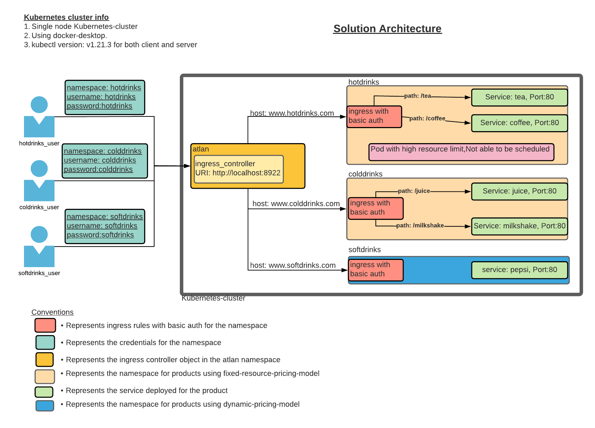

# Atlan Hiring Challenge

## Problem Statement
link : https://www.notion.so/Hiring-Task-Senior-Cloud-Engineer-b67d07ffec45444f9ea96d64f0f2b885
To evaluate the Multi-tenancy approach and provide a detailed report with a working model for the multi-tenancy approach in Kubernetes. 

# Solution
The solution provides a working business model for multi-tenancy approach in Kubernetes. The solution is designed for a company named 'Atlan' that provides service hosting solution to the customers usint SaaS business model. For this demo, we will be treating 'Atlan' as the service provider company. 
Major components of the given business model is as given below.

| Company | Business Role | Namespace in cluster | Service offered/consumed | 
|---------|---------------|----------------------|---------------------------|
| Atlan | Service Provider | atlan | Offers a hosting platform for consumers |
| hotdrinks_corporation | consumer using Fixed-resource-quota model | hotdrinks | Service Name: tea, coffee |
| colddrinks_corporation | consumer using Fixed-resource-quota model | colddrinks | Service Name: juice, milkshake |
| softdrinks_corporation | consumer using Dynamic-pricing model | softdrinks | Service Name: pepsi |

# Concepts
## Multi-tenancy model
A model where the residents of a infra share the usable resources for their own purpose to bring down the cost for themselves while offloading the common functionalities like maintainence, upgrades etc to the common vendor.
Why to go for multi-tenancy:
1. Cost reduction for individual tenants.
2. cost reduction for service vendor.
3. Shared resource utilisation across tenants.

## Implementing multi-tenancy model
These are the major points to consider from a service provider perspective while implementing a multi-tenancy solution.
### Tenant isolation
1. A user in the different tenant should not be able to access the user/service content of another tenant. 

### Resource usage analytics per tenant
1. Need to implement a monitoring solution that measures multiple metrics per tenant for the billing purpose and to guarantee the SLAs between service provider and consumer.

### Sharing common infrastructure
1. In order to save cost from a service provider perspective, we need to share the common cluster compute resources across the tenants.

# Atlan Business model
Atlan will follow these two business model across tenants.

## Fixed-resource-quota model
1. Customers make a agreement with 'atlan' and fix the resource-quota limits (CPUs, Memory) for their usage. Atlan will charge the customers based on the fixed resourcequota.
2. Customers can request to bring-up any number of services till the total required resource consumption of the services is less than the limits of the agreement.
3. Atlan will guarantee that SLA is always met for the customer. Thus, system monitoring responsibility is with atlan.
4. Each customer will be given one namespace in the Atlan hosted kubernetes cluster.

## Dynamic-pricing model
1. Custumers dont make any hard-limit agreements with Atlan. Atan will charge the customers dynamically based on the pricing-slab for total resources used by the services deployed for the customers.
2. Customers can request to bring up any number of services till the pricing suits their budget.
3. Atlan will guarantee that SLA is always met for the customer. Thus, system monitoring responsibility is with atlan.
4. Each customer will be given one namespace in the Atlan hosted kubernetes cluster.

* Note: A customer needing multiple environments will be given a separate namespace for each environment in the atlan k8s cluster and will be charged separately for each namespace.

# Architecture

# Solution : Deep dive
1. The solution is implemented using name based virtual hosting model(reference doc: https://kubernetes.io/docs/concepts/services-networking/ingress/#name-based-virtual-hosting) of ingress. Using this approach multiple consumers can be managed using single Public facing IP. This helps in cost reduction for atlan.
2. Each customer will be identified as a namespace in the k8s cluster owned by atlan.
3. We will use nginx as the ingress controller and it will be deployed in the atlan namespace.
4. Any incoming traffic hitting the ingress controller will be forwarded to the service in the corresponding namespace if it satisfies the auth criteria and ingress rules configured in the ingress rules deployed for the namespace.
5. All the service of the same namespace will be handled by single ingress object for the correspondin namespace.
6. Resource isolation is achieved using the namespaces.
7. Namespaces resource limits is controlled using the ResourceQuota object created for the namespace.
8. Kubernetes cluster is owned and managed by atlan.

# Setup details:
1. Entire solution is implemented using a kubernetes cluster running on local windows laptop.
2. We are running docker-desktop provided kubernetes cluster on the laptop. This is a single node kubernetes cluster solution.
3. Kubernetes cluster details as given below:
----
1. cluster-info

`
> kubectl.exe cluster-info
Kubernetes control plane is running at https://kubernetes.docker.internal:6443
CoreDNS is running at https://kubernetes.docker.internal:6443/api/v1/namespaces/kube-system/services/kube-dns:dns/proxy
`

2. kubectl version 

`      
> kubectl.exe version
Client Version: version.Info{Major:"1", Minor:"21", GitVersion:"v1.21.3", GitCommit:"ca643a4d1f7bfe34773c74f79527be4afd95bf39", GitTreeState:"clean", BuildDate:"2021-07-15T21:04:39Z", GoVersion:"go1.16.6", Compiler:"gc", Platform:"windows/amd64"}
Server Version: version.Info{Major:"1", Minor:"21", GitVersion:"v1.21.3", GitCommit:"ca643a4d1f7bfe34773c74f79527be4afd95bf39", GitTreeState:"clean", BuildDate:"2021-07-15T20:59:07Z", GoVersion:"go1.16.6", Compiler:"gc", Platform:"linux/amd64"}          
`
----

# Solution pre-requisites
1. helm(version-3)
2. openssl: Required to create the named-auth file.
3. kubectl
4. Azure samples chart (https://azure-samples.github.io/helm-charts/) used to bringup services for the demo
    * Add the sample chart using this command. (helm repo add azure-samples https://azure-samples.github.io/helm-charts/)

# Verification
1. Implemented solution can be verified by sending requests to the intended service. 
2. A request sent at the correct path using the authorized credentials will result into success response.
3. A request sent on invalid path but using the authorized credentials will result into 404 not found error.
3. A request sent on valid path but using the unauthorized credentials will result into 401-authorization required error.

